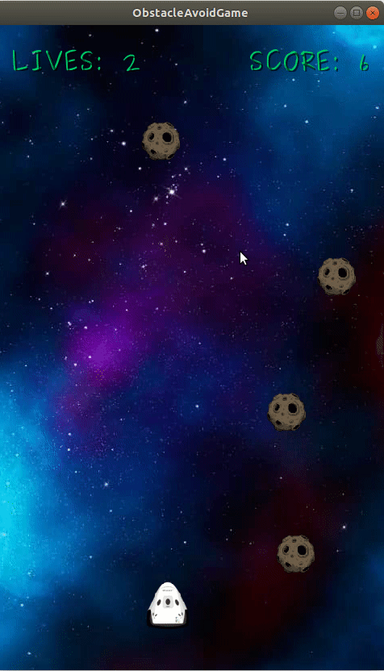

# obstacle-avoidance-game

## Setup in IntelliJ

###### 1. Open build.gradle

In IntelliJ, configure the project by opening the project from the `build.gradle` file in the root directory.

###### 2. Choose Main Class

Configure the main class as:

`com.obstacleavoid.game.desktop.DesktopLauncherKt`

###### 3. Choose working directory

In edit configuration, choose working directory:

`/*your path*/obstacle-avoid-game/android/assets`

###### 4. Choose classpath of module

`desktop`

###### 5. Choose JRE version

`Java version 1.8`

###### 5. Run Game

`shift + f10`

###### 6. Enjoy!